# Methodology
For this project, I used R because it can scrape data from tweets and process large numbers of rows and columns. However, due to time constraints, network service unavailability, and the use of a borrowed computer system, I could not scrape every tweet during the show's weekly release, so I settled on collecting data after the last episode aired. 


## R
### Data Collation
I obtained Twitter's API and using the rtweet library on R, I scraped all non-retweet tweets with the hashtags #TheBoys and #TheBoysFinale from 7 pm, 7th July 2022 (9 hours after the episode aired internationally) till 6 pm, 10th July 2022; West Africa Time
After connecting to Twitter’s API via a token, I scraped the tweets,  formatted the data into a data frame and saved it as a CSV file.

```
#Install necessary packages
library(rtweet)


#Set up the authentication with the API that has details saved in a csv
twitter_auth <- read.csv("twitter_auth.csv")
twitter_auth

create_token(app = "Ijoma Sentiment",twitter_auth$api_key,twitter_auth$api_secret,twitter_auth$access_token,twitter_auth$access_secret)

#Scrape tweets
Hashtags <- c("#TheBoysFinale","#TheBoys")

SEARCH <- paste(Hashtags, collapse = " OR ")

TheBoys<- search_tweets(SEARCH,n = 10000, type = "mixed", include_rts = FALSE)

#Remove duplicate values
library(dplyr)

TheBoys<- distinct(TheBoys)
TheBoys <- TheBoys %>%
  arrange(created_at)

#Save the tweets in a csv file
write_as_csv(TheBoys,file_name = "TheBoysRawTweets.csv")
```

Before I began processing I took a look at the rows and columns selected the ones I needed and answer questions I would ask the data. 


### Data Wrangling
I first noticed that many of the columns within the data frame had values that appeared as lists containing links, tags, and other entities, so I flattened the data frame using the flatten function. I also noticed the dataset had 50 columns which would not all be neede so I used the tidyverse package to pipe the columns I would be using for my analysis
```
Install necessary packages
library(tidyverse)

TheBoys<- read_twitter_csv("TheBoysRawTweets.csv")
TheBoysFlat<- flatten(TheBoys)
TheBoysFlat<- TheBoysFlat %>%
  select(created_at,text,name,screen_name,source,retweet_count,favorite_count,location)
```
When I examined the Twitter data, I noticed that the tweets still had strange special text and inappropriate encoding, which made processing the text difficult. I used the plain_tweets function to standardize the text in each tweet and convert all of the encodings to ASCII.
```
> summary(TheBoysFlat)
hashtags           created_at                         text          
 Length:9697        Min.   :2022-07-08 22:53:37.00   Length:9697       
 Class :character   1st Qu.:2022-07-09 12:49:03.00   Class :character  
 Mode  :character   Median :2022-07-09 19:30:40.00   Mode  :character  
                    Mean   :2022-07-09 20:44:09.31                     
                    3rd Qu.:2022-07-10 03:31:05.00                     
                    Max.   :2022-07-10 17:44:53.00                     
     name           screen_name           source          retweet_count     
 Length:9697        Length:9697        Length:9697        Min.   :   0.000  
 Class :character   Class :character   Class :character   1st Qu.:   0.000  
 Mode  :character   Mode  :character   Mode  :character   Median :   0.000  
                                                          Mean   :   1.512  
                                                          3rd Qu.:   0.000  
                                                          Max.   :4319.000  
 favorite_count       location        
 Min.   :    0.00   Length:9697       
 1st Qu.:    0.00   Class :character  
 Median :    0.00   Mode  :character  
 Mean   :   17.17                     
 3rd Qu.:    2.00                     
 Max.   :34091.00             
 ```
 ```
 > head(TheBoysFlat$text)
[1] "📸 Yeah I probably deserve that. No matter where Hughie and Annie stand, I’m always lucky to have the incredible Erin Moriarty with me in a scene. Thanks for checking out the finale, everyone! #PhotoByJQ #TheBoysFinale #TheBoys https://t.co/fwle75sjPS"
[2] "Hughie Campbell &amp; The Starlights is the Huey Lewis cover-band I never knew I needed. \n\n… We also play Billy Joel.\n\n@TheBoysTV #TheBoys https://t.co/MgXNqqqNdG"                                                                                     
[3] "Hope that sweaty Billy Joel fan is holding up alright. @TheBoysTV #Hughie #TheBoys https://t.co/bbb1oymgDd"                                                                                                                                                 
[4] "e foi assim que surgiu a Revolução Francesa #TheBoysFinale https://t.co/KE3INxnSDb"                                                                                                                                                                         
[5] "esse ̶q̶u̶e̶b̶r̶a̶-̶c̶a̶b̶e̶ç̶a̶ Mural das Conspirações tá mt confuso, e meu cast veio aqui pra desvendar 🗣 já viram todos os easter eggs de #TheBoys no Beco do Batman? https://t.co/6TSsWOsAZu"                                                                         
[6] "Viendo #TheBoysFinale con mi esposa...le pregunté que se sentía hacerlo con un superheroe y me respondió: FABULOSO!\n\nAhorita voy a volar por el cielo de tegus y luego voy a La Ceiba \n\n💧💧🍆 https://t.co/Iepn7f6cdq"  
 ```
```
TheBoysFlat$text<- plain_tweets(TheBoysFlat$text)
```
```
> head(TheBoysFlat$text)
[1] "Yeah I probably deserve that. No matter where Hughie and Annie stand, I'm always lucky to have the incredible Erin Moriarty with me in a scene. Thanks for checking out the finale, everyone! #PhotoByJQ #TheBoysFinale #TheBoys//t.co/fwle75sjPS"
[2] "Hughie Campbell & The Starlights is the Huey Lewis cover-band I never knew I needed. We also play Billy Joel. @TheBoysTV #TheBoys//t.co/MgXNqqqNdG"                                                                                               
[3] "Hope that sweaty Billy Joel fan is holding up alright. @TheBoysTV #Hughie #TheBoys//t.co/bbb1oymgDd"                                                                                                                                              
[4] "e foi assim que surgiu a Revoluo Francesa #TheBoysFinale//t.co/KE3INxnSDb"                                                                                                                                                                        
[5] "esse quebra-cabea Mural das Conspiraes t mt confuso, e meu cast veio aqui pra desvendar j viram todos os easter eggs de #TheBoys no Beco do Batman?//t.co/6TSsWOsAZu"                                                                             
[6] "Viendo #TheBoysFinale con mi esposa...le pregunt que se senta hacerlo con un superheroe y me respondi: FABULOSO! Ahorita voy a volar por el cielo de tegus y luego voy a La Ceiba //t.co/Iepn7f6cdq"                        
```

 It was however not enough as I noticed that there were still tags within the tweets that were not needed, hashtags within the tweets that were not needed as well as the links, of each of those tweets and tweets related to them which would be difficult to work with. I then decided to use the r-lang package along with regular expressions and the gsub function to substitute all tags, links and hashtags with null text. This left me with only clean original tweets

```
TheBoysFlat$text<- gsub("//t.co/[a-zA-Z0-9]+|#[a-zA-Z0-9]+|@[a-zA-Z0-9]+","",TheBoysFlat$text)
```
```
> head(TheBoysFlat$text)
1.content 
"Yeah I probably deserve that. No matter where Hughie and Annie stand, I'm always lucky to have the incredible Erin Moriarty with me in a scene. Thanks for checking out the finale, everyone!"                                                                     
                                                                         2.content 
"Hughie Campbell & The Starlights is the Huey Lewis cover-band I never knew I needed. We also play Billy Joel." 
                                                                                                                                                3.content 
"Hope that sweaty Billy Joel fan is holding up alright. " 
                                                                                                                                                4.content 
"e foi assim que surgiu a Revoluo Francesa" 
                                                                                                                                                5.content 
"esse quebra-cabea Mural das Conspiraes t mt confuso, e meu cast veio aqui pra desvendar j viram todos os easter eggs de no Beco do Batman?" 
                                                                                                                                                6.content 
"Viendo con mi esposa...le pregunt que se senta hacerlo con un superheroe y me respondi: FABULOSO! Ahorita voy a volar por el cielo de tegus y luego voy a La Ceiba  " 
```

### Analysis
To properly process the text within each tweet for natural language processing I had to convert the text into a Corpus. As a Corpus, I could easily process the text within the tweets.

```
#Separate some columns for exclusive analysis
TheBoystext<- TheBoysFlat %>%
  select(text)
TheBoystext<- as.character(TheBoystext$text)

library(tm)

#Turn text into  corpus for easy data manipulation
TheBoys_Corpus<- VCorpus(VectorSource(TheBoystext))
```

 To clean the Corpus so that the information within could be processed I removed the numbers, stop words (common words that appear in almost every text such as and, but etc), punctuation marks, and excess white space and converted all the text to lowercase. This left me with text that only contained keywords of each tweet which could easily be processed.

```
#Clean and transform corpus
TheBoys_Corpus <- tm_map(TheBoys_Corpus,removeNumbers)
TheBoys_Corpus <- tm_map(TheBoys_Corpus,removeWords,stopwords())
TheBoys_Corpus <- tm_map(TheBoys_Corpus,removePunctuation)
TheBoys_Corpus <- tm_map(TheBoys_Corpus,stripWhitespace)
TheBoys_Corpus <- tm_map(TheBoys_Corpus,content_transformer(tolower))
```

After cleaning the text I then converted it into a vector and inputed it into the tweet data frame to be used for processing.

```
text_clean<- c(unlist(sapply(TheBoys_Corpus,'[',"content")))
TheBoysFlat$text<- text_clean
```

I also used the Corpus to create a word cloud of the words that appeared the most in tweets

```
library(wordcloud)
Tweetwords <- as.character(TheBoysFlat$text)
TweetwordsCorpus <- VCorpus(VectorSource(Tweetwords))
wordcloud(TweetwordsCorpus,random.order = FALSE,max.words = 15,random.color = FALSE,rot.per = 0,scale = c(2,0.5))
```


I then began answering demographic-based questions using the tidyverse package, I used the functions to process the data for insights that interested me.

Which locations had the most tweets?  
```
as.data.frame(TheBoysFlat %>%
  filter(!is.na(location))%>%
  count(location,sort = TRUE) %>%
  top_n(5)
)
```
```
Selecting by n
         location    n
1                 2947
2   New York, USA  145
3   United States   76
4 Los Angeles, CA   67
5          Brasil   54
```
Which language was tweeted in the most?  
```
#Use the languages dataset on rtweet to index the language code to the language name of the raw tweets
languages <- TheBoys%>%
  select(created_at,text,alpha=lang)%>%
  inner_join(langs, by = "alpha")%>%
  select(language=english)%>%
  group_by(language)%>%
  count(language)%>%
  arrange(desc(language))

write.csv(languages,file = "TheBoys languages.csv")
```
```
> head(languages)
  language	n
1	Welsh	20
2	Vietnamese	2
3	Urdu	6
4	Ukrainian	14
5	Turkish	169
6	Thai	18

```
Which hashtags appeared the most in the tweets?  
```
TopHashtag<- as.data.frame(TheBoysFull%>%
  unnest_tokens(hashtag,text,"tweets",to_lower = FALSE)%>%
  filter(str_detect(hashtag,"^#"))%>%
  count(hashtag,sort = TRUE)%>%
  top_n(10)
)
```
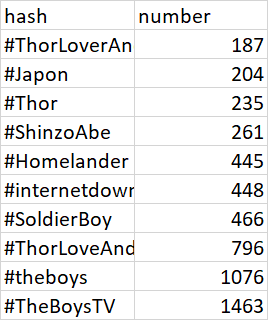

Which tweet has the most likes?  
```
as.data.frame(TheBoysFull %>%
  arrange(desc(favorite_count))%>%
  top_n(1,favorite_count)%>%
  select(screen_name,text,favorite_count,status_url)
)
```
```
screen_name
1   TheBoysTV
                                                                                                       text
1 #TheBoysFinale has landed — all wrapped up in daddy issues and the American flag. https://t.co/iVD5UvRdDc
  favorite_count                                               status_url
1          41603 https://twitter.com/TheBoysTV/status/1545196975573835778
```
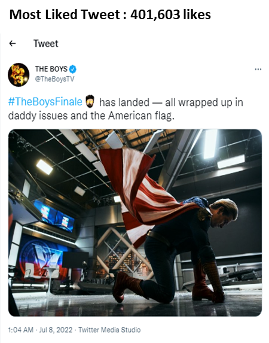

Which tweet has the most retweets?  
```
as.data.frame(TheBoysFull %>%
  arrange(desc(retweet_count))%>%
  slice(1)%>%
  select(screen_name,status_url,retweet_count)
)
```
```
screen_name                                               status_url
1   TheBoysTV https://twitter.com/TheBoysTV/status/1545186537679101952
  retweet_count
1          3508
```
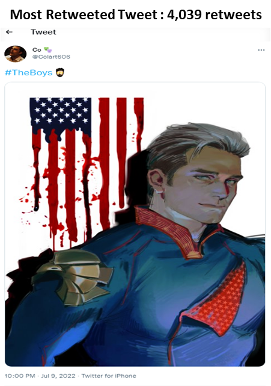


An interesting value I wanted to discover was the velocity of tweets; ie: the number of tweets tweeted per hour, from the point of the season finale's airing to the end of the weekend. To achieve this I formatted the created at column to separate it into its date and time. I would mutate the date using the as date function and format the time using the as.POSIXct function to convert the value from Year-Month-Day Hour:Minute:Second to simply Year-Month-Day Hour.

```
time_series<-as.data.frame(
    format(as.POSIXct(TheBoysFlat$created_at,format = "%Y-%m-%d %H:%M:%S"),format = "%Y-%m-%d %H:00")
)
names(time_series)[[1]]<-"tweet_time"
write.csv(time_series,file = "theboystimeseries.csv")
```

This allowed me to create a Time series data frame in which I rounded up the total number of tweets to their respective dates and times down to the floor hour, giving me a Time series that I would use for my visualizations.

```
> head(time_series)
        tweet_time
1 2022-07-08 01:00
2 2022-07-08 17:00
3 2022-07-08 18:00
4 2022-07-08 21:00
5 2022-07-08 14:00
6 2022-07-07 19:00
```

After this, I finished my analysis of demographic data and thus I began my sentiment analysis. 


My sentiment analysis of the entire show and sentiment analysis of each main character also made use of natural language processing. 
Sentiment analysis is performed using a series of steps in R. I selected the text and the time that the tweet was made within that text. There were tokens and I unnested these tokens in order to make each word a unique entity. I joined the words of each text using the **afinn** sentiment score grouped by the text and then summarised the text into its sentiment scores for each tweet. With this output, I then allocated each score to the date and time it was created to the floor hour. I grouped these hourly sentiment score averages and saved these hourly average sentiment scores into a CSV file.

```
#Sentiment analysis
output<- TheBoysFlat%>%
  select(text,created_at)%>%
  unnest_tokens(word,text,drop = FALSE)%>%
  inner_join(get_sentiments("afinn"))%>%
  group_by(text,created_at)%>%
  summarise(sentiment_score=sum(value))


output$created_at<-format(as.POSIXct(output$created_at,format = "%Y-%m-%d %H:%M:%S"),
                                          format = "%Y-%m-%d %H:00") 

hourly_overall<- output%>%
  group_by(created_at)%>%
  summarise(avg_sentiment = mean(sentiment_score), total_sentiment = sum(sentiment_score))

write.csv(hourly_overall,file = " TheBoys HourlySentiment.csv")
```

```
> head(hourly_overall)
  X       created_at avg_sentiment total_sentiment
1 1 2022-07-07 19:00     3.0000000               3
2 2 2022-07-08 01:00     3.0000000               3
3 3 2022-07-08 14:00     0.3636364              20
4 4 2022-07-08 15:00     0.6976744             180
5 5 2022-07-08 16:00     0.4301075             120
6 6 2022-07-08 17:00     0.2483221              74
```


To create a character-based sentiment analysis I had to link each tweet to the respective characters mentioned in the tweets. I used if-else functions to guide the selection of each tweet and characters within the tweets using a csv file containing the names of characters and actors who played them. This led to the creation of a text character column which would show any character name associated with any tweets that had that character's name or the name of the actor that played said character. I then filtered out any tweets that were not associated with any character. I then processed the average sentiment score for each character within the character data frame that had been created using a for loop. For tweets involving multiple characters I split them and unnested them so the sentiment scores on tweets mentioning multiple characters could be calculated as well I then grouped these sentiment scores and summarized them. Finally, I save these average character sentiment scores into a CSV file. 

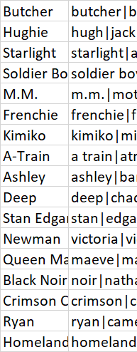

```
characters<-read.csv("characters.csv",header = FALSE)
a<-1
for (i in characters[[1]]){
  output[[i]] <- ifelse(grepl(characters[a,2],tolower(output$text)),i,"")
  a<-a+1
}

output$character<- apply(output[4:20], 1, function(x) paste(x[!is.na(x) & x!=""],
                         collapse = ", "))

x <- as.numeric(nrow(characters)+4)
output <- output[c(1:3,x)]

output <- output%>%
  mutate(character = strsplit(gsub("[][\"]","", character),", "))%>%
  unnest(character)%>%
  group_by(created_at,character)%>%
  summarise(avg_sentiment=mean(sentiment_score))

output<- output%>%
  select(created_at,avg_sentiment,character)

write.csv(output,file = paste0("character sentiment-",today(),".csv"))
```
```
> head(character_sentiment)
  X       created_at avg_sentiment  character
1 1 2022-07-08 01:00     3.0000000 Homelander
2 2 2022-07-08 14:00    -1.0000000    A-Train
3 3 2022-07-08 14:00    -1.0000000 Black Noir
4 4 2022-07-08 14:00     0.7500000    Butcher
5 5 2022-07-08 14:00     6.0000000       Deep
6 6 2022-07-08 14:00    -0.2666667 Homelander
```

To calculate the character popularity I looped through the data frame to count each time a character was mentioned in a tweet and counted the sum of each character mentioned. After summarizing the character mentioned I saved it in a character popularity CSV file. 

```
characters<-read.csv("characters.csv",header = FALSE)

popularity<- TheBoysFull%>%
  select(created_at,text)

b<-1
for (i in characters[[1]]){
  popularity[[i]] <- ifelse(grepl(characters[b,2],tolower(popularity$text)),i,"")
  b<-b+1
}

popularity$character<- apply(popularity[3:19], 1, function(x) paste(x[!is.na(x) & x!=""],
                                                            collapse = ", "))

x <- as.numeric(nrow(characters)+3)
popularity <- popularity[c(1,2,x)]

popularity <- popularity%>%
  mutate(character = strsplit(gsub("[][\"]","", character),", "))%>%
  unnest(character)%>%
  group_by(created_at,character)

popularity<- popularity%>%
  select(created_at,character)

write.csv(popularity,file = "character popularity.csv")
```
```
> head(character_popularity)
  X          created_at   character
1 1 2022-07-08 01:06:49  Homelander
2 2 2022-07-08 14:50:18        M.M.
3 3 2022-07-08 14:50:33     Butcher
4 4 2022-07-08 14:50:33 Soldier Boy
5 5 2022-07-08 14:50:33  Homelander
6 6 2022-07-08 14:51:11  Homelander
```

## Visualizations
### Excel
I loaded all the CSV files I had created into Excel to not only carry out some final analysis but to properly visualize the data.

I counted as well as summed the number of likes and retweets of each tweet hard to access the entire online presence of the hashtags. 

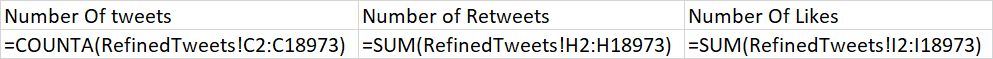


##### Character sentiments 
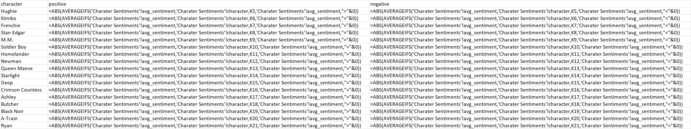
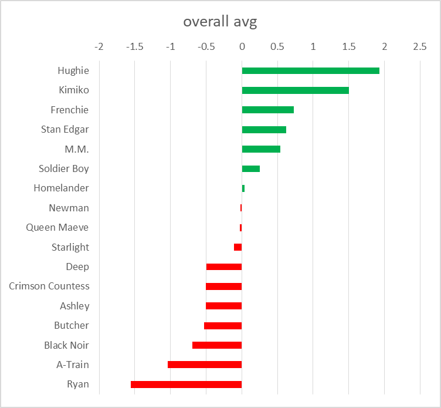

##### Character popularity 
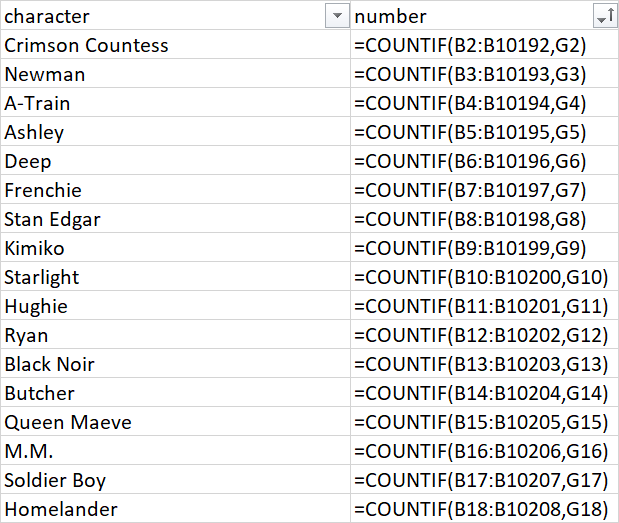  

After filtering out the top values I was left with what made this chart  

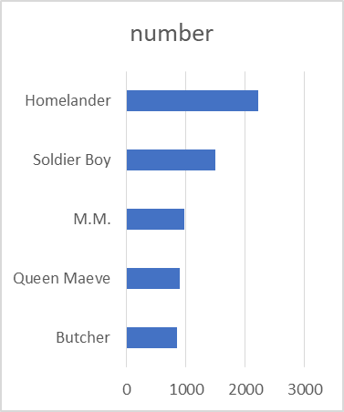

##### Total sentiments 
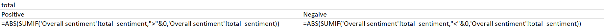
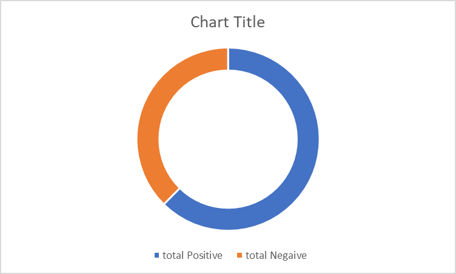

##### Languages 
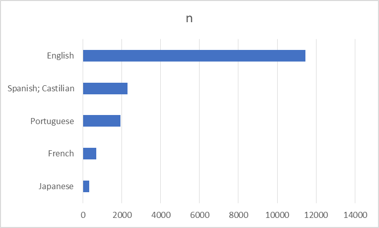


##### Time series 
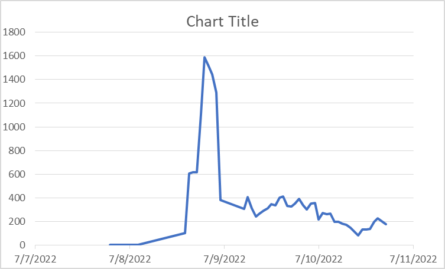


##### Locations
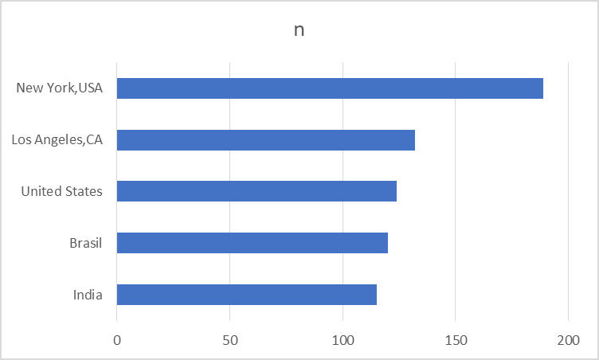

After processing all the available data using r and Excel I created the dashboard below

  

